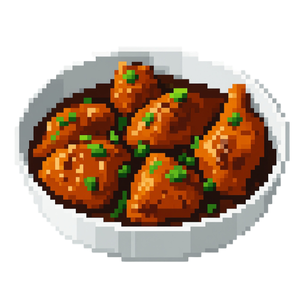
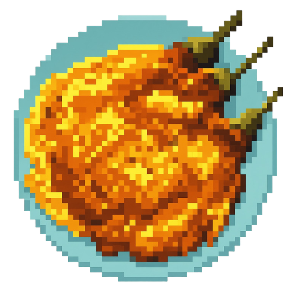
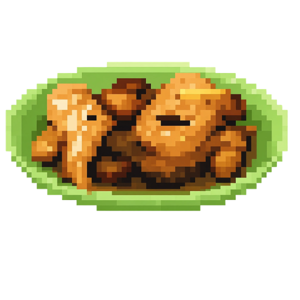
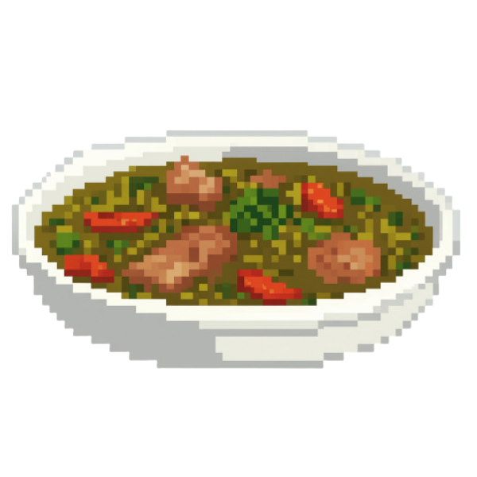
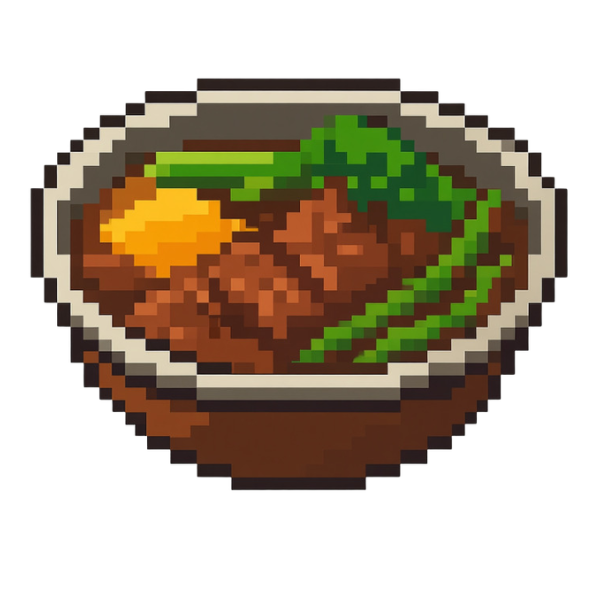

<h1 align="center">ੈ✩‧₊˚Palayok - Your Filipino Cooking Companion‧₊˚✩ ੈ</h1>
<p align="center">
  
</p>

> *"Tara, luto!"* — Come, let's cook!

---

## What is Palayok? ⌯⌲

**Palayok** (Filipino for *clay pot*) is a mobile cooking guide app designed to bring the warmth and soul of Filipino home cooking to your fingertips. Guided by **Sandok** — your friendly in-app kitchen companion — Palayok walks you through authentic Filipino dishes with clarity, care, and a little bit of *kuya/ate* energy.

Whether you're a first-timer curious about adobo or a home cook looking to nail your lola's nilaga, Palayok has you covered.

---

## Meet Sandok ₊⊹

<table>
  <tr>
    <td></td>
    <td>
      <strong>Sandok</strong> (Filipino for <em>ladle</em>) is your in-app guide — warm, encouraging, and always ready with the next instruction. He greets you on loading, walks you through prep, and cheers you on through every step.
      <br><br>
      <em>"Onions chopped, now move to our next step."</em><br>
      <em>"Garlic ready, now move to our next step."</em><br>
      <em>"Nice one! Now let's wait for the chicken to be golden brown."</em>
    </td>
  </tr>
</table>

---

## ✎ Features

### 🥘 Dish Library
Browse a curated collection of classic Filipino recipes, each with:
- Cooking time and serving size
- Difficulty level (Easy / Average / Difficult)
- Full ingredients list
- Step-by-step instructions

**Current Menu:**

<div align="center">

| Dish | Image | Time | Difficulty | Serves |
|:---:|:---:|:---:|:---:|:---:|
| **Adobo** |  | 45 mins | Easy | 4 |
| **Tinola** |  | 45 mins | Average | 4 |
| **Tortang Talong** |  | 25 mins | Easy | 3 |
| **Paksiw na Bangus** |  | 45 mins | Average | 4 |
| **Pork Monggo** |  | 90 mins | Average | 4 |
| **Nilagang Baka** |  | 103 mins | Easy | 4 |

</div>

---

### Two Cooking Modes ⟡ ݁₊ .

#### 📖 Read-Only Mode
A clean, distraction-free view of the full recipe — ingredients and numbered steps all in one place. Perfect for experienced cooks who just need a quick reference.

#### ⏱️ Real-Time Cooking Mode *(Recommended for first-timers!)*
An interactive, step-by-step guided experience that takes you through the cooking process one action at a time:
- **Prep phase** — guided ingredient chopping and preparation
- **Cooking phase** — action-by-action instructions with built-in timers
- **Contextual prompts** — Sandok narrates each step in a friendly, conversational tone
- **Timer support** — start timers right from the screen so nothing gets overcooked

---

## ˖᯽ Object-Oriented Design Principles

Palayok's system is built with the four pillars of **Object-Oriented Programming (OOP)** in mind:

### 1. Encapsulation ༉‧₊˚.
Each recipe is modeled as a self-contained object — it holds its own data (ingredients, steps, duration) and exposes only what the UI needs. Internal cooking logic is hidden away, keeping the interface clean and the data safe from unintended modification.

> *Like a palayok itself — the heat, steam, and simmering all happen inside. You just lift the lid when it's ready.*

---

### 2. Inheritance ༉‧₊˚.
The inheritance is implemented in the 'Step` class, which serves as the base structure for steps in the system. It defines the shared foundation that is extended by its child classes, `BasicStep` and `TimedStep`. Each child class inherits the common behavior from `Step` while providing its own specialized implementation, allowing different step types to function without duplicating code.

> *Every Filipino dish starts from the same foundation: heat, seasoning, and patience. What makes each unique is what it adds on top.*

---

### 3. Polymorphism ༉‧₊˚.
The `CookingMode` interface can be implemented as either `ReadOnlyMode` or `RealTimeMode`. The app calls the same `startCooking()` method regardless of which mode is active — each mode just handles it differently under the hood. It also uses the `Recipe Aware Screen’s` Set Recipe mechanism, allowing its child components (both interactive and read-only screens) to implement their own version of setting the recipe based on their specific behavior and requirements.

> *Same pan, different technique. You can boil, fry, or simmer — the stove doesn't care. It just provides the heat.*

---

### 4. Abstraction ༉‧₊˚.
Users interact with simple screens: pick a dish, choose a mode, follow the steps. The complexity behind managing timers, tracking progress, and transitioning between prep and cooking phases is completely abstracted away.

> *You don't need to know how the clay pot was fired to cook in it. You just need to know what goes inside.*

---

## 📱 App Structure (UI Flow)

```
Loading Screen
    └── Welcome / Onboarding (Sandok introduces himself)
            └── Meal Selection Screen
                    ├── Recipe Detail View
                    │       └── Ingredients Checklist
                    └── Choose Cooking Mode
                            ├── Read-Only Mode
                            │       └── Full Instructions View
                            └── Real-Time Mode
                                    ├── Prep Phase (Chop / Prepare)
                                    │       └── Step confirmations with "Next"
                                    └── Cooking Phase
                                            └── Step-by-step with Timers → Done
```

---
## 🗂️ Folder Structure
```
Palayok/
├── AReadMe/
├── Palayok/
│   ├── Audio/
│   ├── Data/
│   ├── Models/
│   ├── Properties/
│   ├── Resources/
│   ├── UI/
│   ├── Palayok.csproj
│   └── Program.cs
├── .gitattributes
├── .gitignore
├── Palayok.slnx
├── PatchNotes.md
└── README.md
```

---
## 🌿 Philosophy 

**Palayok** isn't just a recipe app — it's a love letter to Filipino home cooking. Every dish in the library carries stories: the garlic sautéed until golden, the vinegar that never gets stirred right away, the malunggay leaves added last so they stay bright and fresh.

The goal is simple: make Filipino cooking accessible, approachable, and joyful — for _anyone, anywhere_.

---
## Acknowledgment⋆˚౨ৎ ⋆.˚

We sincerely express our gratitude to our instructor for the guidance, support, and insights shared throughout this project.  Their expertise greatly helped deepen our understanding of Object-Oriented Programming.

We also thank our classmates and peers for their cooperation, feedback, and encouragement, which contributed to improving the overall quality of this work.

This project reflects a collaborative effort, and we appreciate everyone who contributed to its completion.

---

## 🕸 Disclaimer

This project was developed for academic purposes under **CS 222 — Advance Object-Oriented Programming**.  It is intended only as a reference. Please avoid copying or submitting it as your own work.

---
<h1 align="center">「 ✦ Contributors ✦ 」</h1>

<div align="center">

<table>
<tr>

<!-- Member 1 -->
<td align="center" width="250">


<a href="https://github.com/ry6969" target="_blank">
  
</a>

<br>
<strong>@ry6969</strong>

</td>

<!-- Member 2 -->
<td align="center" width="250">

<a href="https://github.com/Laurenzedc" target="_blank">
  
</a>

<br>
<strong>@Laurenzedc</strong>

</td>

<!-- Member 3 -->
<td align="center" width="250">


<a href="https://github.com/Haidonuts" target="_blank">
  
</a>

<br>
<strong>@Haidonuts</strong>

</td>

</tr>
</table>

</div>

---

<p align="center"><em>Made with heart and a bowl of rice.</em> ❤️</p>
